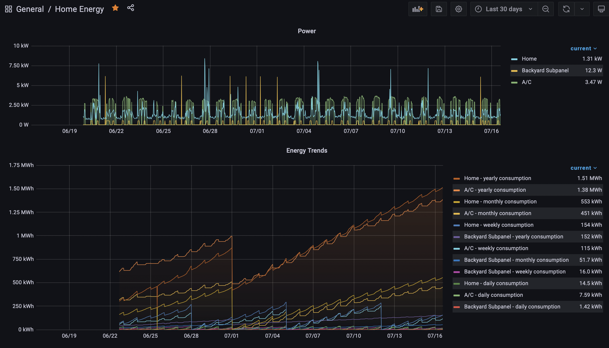
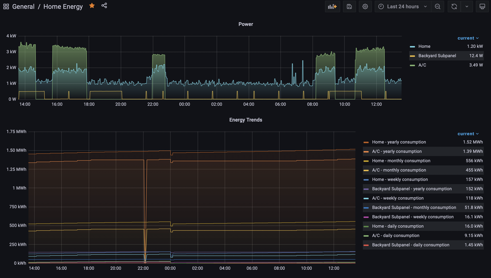

> **Note**
> See the latest release to the right and select the corresponding branch or tag above for applicable README instructions

# Sense Energy Prometheus Exporter

This is a prometheus exporter for the [Sense](https://sense.com) energy monitor products.

# Is this the right tool for me?
With this exporter, you can create charts in grafana like this:

#### Last 30 days:


#### Last 24 hours:


In my case, I have 3 electrical panels:
* A/C panel
  * The line splits off in the main service panel before the whole-home breaker
* Whole-home panel
* Backyard subpanel
  * The line also splits off in the main service panel before the whole-home breaker
  * There is a hot tub attached to this panel
  
In these charts you can see both realtime usage and daily/weekly/monthly usage trends.

It's interesting to see that even though my A/C and home are monitored by different sense devices,
I can break down how much my A/C condenser uses vs how much the blower uses (the blower is inside
the house and monitored by the sense device attached to my whole-home breaker lines).

My hot tub turns on one pump every 30m to check the water temperature. I can also see when it turns on
for the filter cycles. And I can see when the hot tub heater turns on and how much energy it uses (it's 
interesting to compare summer vs winter!)

# OK I want it. How do I get it?
To use this tool, you'll need docker installed on your computer, and you'll need to be comfortable
with the command line.

You'll get the most value by having this running all the time, queried by prometheus, and viewing
the metrics via grafana.

See [the sample metrics](data/metrics.txt) for a list of metrics you can query in prometheus.

Internally it uses the [Sense Energy Monitor API Interface](https://github.com/scottbonline/sense) client.

The image can be found on
[GitHub Packages](https://github.com/ejsuncy/sense_energy_prometheus_exporter/pkgs/container/sense_energy_prometheus_exporter). 

## Usage
```shell
docker pull ghcr.io/ejsuncy/sense_energy_prometheus_exporter:0.4.0a
```

### Running locally
An example of using this exporter for 3 different Sense devices/accounts:

```shell
docker run --rm \
-e EXPORTER_LOG_LEVEL="DEBUG" \
-e SENSE_ACCOUNT_NAME_1="A/C" \
-e SENSE_ACCOUNT_USERNAME_1="account1@test.com" \
-e SENSE_ACCOUNT_PASSWORD_1='~!my_password_1!~' \
-e SENSE_ACCOUNT_NAME_2="Backyard Subpanel" \
-e SENSE_ACCOUNT_USERNAME_2="account2@test.com" \
-e SENSE_ACCOUNT_PASSWORD_2='~!my_password_2!~' \
-e SENSE_ACCOUNT_NAME_3="Home" \
-e SENSE_ACCOUNT_USERNAME_3="account3@test.com" \
-e SENSE_ACCOUNT_PASSWORD_3='~!my_password_3!~' \
-e TZ="America/Denver" \
-it --network bridge \
-p"9993:9993" \
--mount type=bind,source="$(pwd)"/volumes,target=/etc/sense_energy_prometheus_exporter \
ghcr.io/ejsuncy/sense_energy_prometheus_exporter:0.4.0a
```

Then visit in your browser:
```shell
http://0.0.0.0:9993/metrics
```

You can find sample metric output in [data/metrics.txt](data/metrics.txt).

#### Environment Variables

| Variable | Description | Options | Default |
|---|---|---|---|
| `EXPORTER_LOG_LEVEL` | Controls verbosity of logs | `DEBUG`, `INFO`, `WARNING`, `ERROR` | `INFO` |
| `SENSE_ACCOUNT_NAME_<n>` | The name to identify the account by. `<n>` is an integer that links the other env vars containing `<n>`. | | |
| `SENSE_ACCOUNT_USERNAME_<n>` | The username (email address) used to login to the account. `<n>` is an integer that links the other env vars containing `<n>`. | | |
| `SENSE_ACCOUNT_PASSWORD_<n>` | The password used to login to the account. `<n>` is an integer that links the other env vars containing `<n>`. | | |
| `TZ` | The timezone to use for the container. Use the string in `TZ database name` column of the [List of TZ Database Time Zones](https://en.wikipedia.org/wiki/List_of_tz_database_time_zones). | | None (container defaults to UTC time)|
| `EXPORTER_PORT` | The port to listen on | | `9993` |
| `EXPORTER_BIND_HOST` | The address to listen on | | `0.0.0.0` |
| `EXPORTER_NAMESPACE` | The prefix to use for prometheus metrics | | `sense_energy` |
| `CONFIG_FILE` | The container filepath to the config file | | `/etc/sense_energy_prometheus_exporter/config.yaml` |

### Running on kubernetes
A sample manifest:
```yaml
# Service
apiVersion: v1
kind: Service
metadata:
  name: prometheus-exporters-sense
spec:
  type: LoadBalancer
  ports:
    - name: sense
      port: 80
      targetPort: 9993
      protocol: TCP
  selector:
    app: prometheus-exporters-sense
---

# Secrets
apiVersion: v1
kind: Secret
metadata:
  name: secrets-sense
type: Opaque
data:
  # obtain b64 encoded password with `echo -n "<password>" | b64`
  SENSE_ACCOUNT_PASSWORD_1: "<b64-encoded password here>"
  SENSE_ACCOUNT_PASSWORD_2: "<b64-encoded password here>"
  SENSE_ACCOUNT_PASSWORD_3: "<b64-encoded password here>"
---
# Deployment
apiVersion: apps/v1
kind: Deployment
metadata:
  labels:
    app: prometheus-exporters-sense
  name: prometheus-exporters-sense
spec:
  replicas: 1
  selector:
    matchLabels:
      app: prometheus-exporters-sense
  template:
    metadata:
      labels:
        app: prometheus-exporters-sense
    spec:
      containers:
      - image: ghcr.io/ejsuncy/sense_energy_prometheus_exporter:0.4.0a
        name: sense
        resources:
          limits:
            cpu: 1000m
            memory: 1500Mi
          requests:
            cpu: 500m
            memory: 1G
        ports:
          - name: http
            containerPort: 9993
            protocol: TCP
        env:
          - name: EXPORTER_LOG_LEVEL
            value: DEBUG
          - name: SENSE_ACCOUNT_NAME_1
            value: A/C
          - name: SENSE_ACCOUNT_USERNAME_1
            value: account1@test.com
          - name: SENSE_ACCOUNT_NAME_2
            value: Backyard Subpanel
          - name: SENSE_ACCOUNT_USERNAME_2
            value: account2@test.com
          - name: SENSE_ACCOUNT_NAME_3
            value: Home
          - name: SENSE_ACCOUNT_USERNAME_3
            value: account3@test.com
          - name: TZ
            value: America/Denver
        envFrom:
          - secretRef:
              name: secrets-sense
```

Of course, you should fine-tune the memory and cpu requests and limits.
Also note that multiple replicas for High Availability (HA) may get you rate-limited or 
have your connections dropped since there's currently no built-in leader election.

You might configure your prometheus scrape settings in a configmap as such:
```yaml
apiVersion: v1
data:
  prometheus_config: |
    global:
      scrape_interval: 15s
      external_labels:
        monitor: 'k8s-prom-monitor'
    scrape_configs:
      - job_name: 'sense'
        metrics_path: /metrics
        scrape_interval: 3m
        scrape_timeout: 1m
        static_configs:
          - targets:
              - 'prometheus-exporters-sense'
kind: ConfigMap
metadata:
  name: prometheus-config
```

**Again, be careful of the scrape interval.** The internal client does some self-throttling but make sure you don't
swamp the sense servers.

## Development
### Building
Assume all development starts with this virtual environment:
```shell
make venv
source .venv/bin/activate
```

Make and commit changes and create a PR to the `main` branch.

Once the changes are approved and merged to `main`, the repository owner can 
check out the latest code and [release the new version](#releases).

### Containerizing
Clone this repository and containerize for your machine, tagging the image however you want:
```shell
docker build -t ghcr.io/ejsuncy/sense_energy_prometheus_exporter:local .
```

Or build for other architectures (for example, if you're developing on an ARM mac but deploying to AMD linux kubernetes):
```shell
docker buildx build -t ghcr.io/ejsuncy/sense_energy_prometheus_exporter:local --platform linux/amd64 .
```

Build locally for multiple architectures:
```shell
make build
```

## Releases

### Making a minor version release
1. Bump the new minor version of this container
    ```shell
    BUILDRUNNER_BUMP_TYPE=alpha buildrunner -s bump-version
    ```
2. Commit, open a PR, and merge changes to `main`
3. Make the release on GitHub with the new minor version tag
    ```shell
    git checkout main && \
    git pull && \
    make release-github
    ```
4. Build and Publish the image
    ```shell
    make release-ghcr
    ```
5. Make a new branch from `main` with the new version name (ie `0.0.x`)
6. Move `main` to the next `alpha` version to capture future development
    ```shell
    make alpha
    ```

### Making a patch version release
1. Start with the version branch to be patched (ie `0.0.x`)
2. Run a `patch` and `alpha` version bump
    ```shell
    BUILDRUNNER_BUMP_TYPE=patch buildrunner -s bump-version && \
    BUILDRUNNER_BUMP_TYPE=alpha buildrunner -s bump-version
    ```
3. Make a patch branch
    ```shell
    git checkout -b "patch-$(cat VERSION.txt | tr -d '\n')"
    ```
4. Commit, open a PR, and merge changes to the version branch
5. Make the patch release on GitHub targeting the minor version branch with the new patch version tag
    ```shell
    make release-patch-github
    ```
6. Build and publish the patch image
    ```shell
    make release-ghcr
    ```